# Информатика

## Немного информации

Данный курс рассчитан на студентов, впервые столкнувшихся с программированием. Здесь Вы познакомитесь с полезными программами, методами создания кода, логическим мышлением, а также поробуете начать решать задачи. Конечно, для начала самые простые, но все же реальные.

Ниже подбробно описана установка и настройка необходимого ПО для разработки, даны полезные ссылки на ресурсы, где есть информация по использованию того или иного ПО от разработчиков.

Если у Вас что-то не будет получаться, получить консультацию Вы можете в комнате 260 второго корпуса. Подходите, не стесняйтесь.  

"*It's better to ask a question and be a fool for five minutes instead of keeping silence and remaining a fool for the whole life.*"
## Где мы?

Это сайт GitHub. В первую очередь - это сервис для совместной разработки и хостинга проектов. C помощью GitHub над кодом проекта может работать неограниченное количество программистов из любых точек мира. В GitHub есть система контроля (управления) версий Git: сервис позволяет просматривать и контролировать любые изменения кода любым разработчиком и возвращаться к состоянию до изменений.

## План подготовки к работе
1. [Установка полезных программ](#title1)
2. [Основы GIT](#title2)
3. [Подготовка к Python](#title3)

## <a id="title1">Установка программ</a>

### Установка программ

**Обязательные**
1. [Visual Studio Code](https://code.visualstudio.com/download)
2. [Python](https://www.python.org/downloads/)

**Важно!**  
При установке Python поставить галочку `add to PATH`.


**Необязательные**

   * [Git/Windows](https://git-scm.com/download/win) или [Git/Unix](https://git-scm.com/book/ru/v2/Введение-Установка-Git)
   * [Fork](https://git-fork.com)
   * [Sublime Merge](https://www.sublimemerge.com/download)
   * [PyCharm](https://www.jetbrains.com/ru-ru/pycharm/) 'Community Edition'
   
### Настройка

Сейчас речь пойдет о настройке Python.
Если Вы работаете на Windows, то скорее всего Python у вас не было. Первое, что необходимо сделать, это проверить работоспособность Python. Для этого откройте командную строку и выполните команду `python`. Должен запуститься интерпретатор, показывающий версию питона и ждущий от вас указаний.

Если всего этого не происходит, необходимо проверить, добавлена ли папка с Python в переменные среды.

На Linux уже стоит Python с версией 2.х. Поэтому для запуска в терминале необходимо выполнить команду `python3`.

### PIP

pip — система управления пакетами, которая используется для установки и управления программными пакетами, написанными на Python. Много пакетов можно найти в Python Package Index (PyPI).

Начиная с версии Python 2.7.9 и Python 3.4, они содержат пакет pip (или pip3 для Python 3) по умолчанию.

Иногда может случиться так, что данной системы у вас не будет. Ее наличие можно проверить с помощью запуска команды

```
$ pip #На Windows
#или
$ pip3 #Linux, macOS
```

Если Вы увидите что-то наподобие такого

```
$ pip

Usage:
  pip <command> [options]

Commands:
  install                     Install packages.
  download                    Download packages.
  uninstall                   Uninstall packages.
  freeze                      Output installed packages in requirements format.
  list                        List installed packages.
  show                        Show information about installed packages.
  check                       Verify installed packages have compatible dependencies.
  config                      Manage local and global configuration.
  search                      Search PyPI for packages.
  cache                       Inspect and manage pip's wheel cache.
  index                       Inspect information available from package indexes.
  wheel                       Build wheels from your requirements.
  hash                        Compute hashes of package archives.
  completion                  A helper command used for command completion.
  debug                       Show information useful for debugging.
  help                        Show help for commands.
```
то он у вас есть. В противном случае будет ошибка.
 
 Чтобы поставить какою-либу библиотеку, например ***numpy***, используйте

 ```
 $ pip install numpy
 ```

 Если системы pip у вас нет, установить ее можно следующим образом

 ```
 $ sudo apt get python3-pip #На Linux
 ```

На Windows менеджер пакетов pip устанавливается автоматически. 
## <a id="title2">Создание репозитория в GitHub</a>

Есть два пути создания:

1. Создать локальный репозиторий (*Локальный репозиторий - это папка на вашем компьютере. Она является клоном той, что находится на сервере Git*) на компьютере и потом отправить его на сервер.
2. Создать репозиторий на сайте и сделать клон.

Однако, сначала необходимо войти в Git.
1. Регистрация/вход в локальном Git
   
```
$ git config --global user.name "FirstName LastName"
$ git config --global user.email mail_adress@example.com
```
**Важно!**  
Если указана опция `--global`, то эти настройки достаточно сделать только один раз, поскольку в этом случае Git будет использовать эти данные для всего, что вы делаете в этой системе. Если для каких-то отдельных проектов вы хотите указать другое имя или электронную почту, можно выполнить эту же команду без параметра `--global` в каталоге с нужным проектом.

2. Проверка настроек

```
$ git config --list
user.name=FirstName LastName
user.email=mail_adress@example.com
color.status=auto
color.branch=auto
color.interactive=auto
color.diff=auto
```
### Вариант номер раз

Для начала создадим репозиторий на сайтеб например с именем *MyFirstRep*.
Открываем программу Git Bash и при помощи следующих команд перемещаемся в папку, где хоти создать репозиторий

```
$ cd /Users/yourName/myProjects/Informatics [for example]
or
$ cd ./Documents/Polytech
```
Папка создается при помощи команды
```
$ mkdir MyFirstRep
```
Переместимся в эту папку и создадим репозиторий

```
$ cd MyFirstRep
$ git init
```

Эта команда создаёт в текущем каталоге новый подкаталог с именем .git, содержащий все необходимые файлы репозитория — структуру Git репозитория. На этом этапе ваш проект ещё не находится под версионным контролем. Подробное описание файлов, содержащихся в только что созданном вами каталоге .git, приведено [тут.](https://git-scm.com/book/ru/v2/Git-изнутри-Сантехника-и-Фарфор#ch10-git-internals)

Отправка изменений в чистый репозиторий осуществляется при помощи команды

```
git remote add <repository_name> link
```
Вместо ***repository_name*** нужно дать имя удаленному репозиторию. Далее в инструкции вместо этого параметра мы будем использовать origin, так как чаще всего используют это имя.

Вместо ***link*** — ссылка на удаленный репозиторий, она может выглядеть по-разному в зависимости от того используется ssh или https. 

Если вы хотите добавить под версионный контроль существующие файлы (в отличие от пустого каталога), вам стоит добавить их в индекс и осуществить первый коммит изменений. Добиться этого вы сможете запустив команду `git add` несколько раз, указав индексируемые файлы, а затем выполнив `git commit`:

```
$ git add file1
$ git add file3
$ git commit -m 'Description of your commit'
```
Теперь свяжем локальный и удаленный репозитории
```
$ git remote add origin https://github.com/UserName/MyFirstRep.git
```
После этого необходимо сделать пуш изменений на сервер:

```
$ git push -u origin main
```
Забегая вперед, отмечу, что у вас может возникнуть затруднение в использовании *Git Bash*.  
[Тут](#title3) приведены основные команды терминала Bash для работы.

### Вариант номер два


Идем на [GitHub](https://github.com) и создаем там новый репозиторий. Указываем тип (приватный или публичный), пишем описание (опционально), проверяем ReadMe и .gitignore. Затем жмакаем кнопку **Code** и копируем адрем. После этого идем в терминал git. 
Выбираем ту директорию, где хотим хранить локальную версию и выполняем команду

```
$ git clone [тут наш адрес]
```
После указанных действий у вас будет создан репозиторий.

О первоначальной настройке гита подробнее [**тутъ.**](https://git-scm.com/book/ru/v2/Введение-Первоначальная-настройка-Git)


Что такое .gitignore? Читать [**тутъ.**](https://docs.github.com/ru/get-started/getting-started-with-git/ignoring-files)

## Для создания страницы профиля

На сайте гита создайте еще один новый репозиторий, **имя которого будет соответствовать** названию аккаунта, при этом обязательно поставьте галочку для создания README файла.
Теперь на главной странице вашего профиля будет отображаться содержимое этого файла. Отредактируйте его!

Писать код можно в HTML5 или [Markdown](https://www.markdownguide.org/basic-syntax/) (рекомендую его, как более простой для начинающих).

### Еще немного про VS Code

Теперь, когда у нас есть аккаунт и даже репозиторий на гите, для удобства можно все это прикрутить к VS Code. Для начала необходимо войти в профиль в VS Code с профилем Git. 
После этого будет стандартный запрос в браузере, мы разрешаем и возвращаемся обратно в VSC. Слева на панели ищем вкладку с магазином расширений. Там ищем расширения для нашей следующей работы:

* `ms-python.vscode-pylance`  
  > Это языковая поддержка Python по умолчанию в Visual Studio Code, которая поставляется как часть этого расширения в качестве дополнительной зависимости.
* `MS-CEINTL.vscode-language-pack-ru`
   > Русский язык для работы в VSC (опционально).
* `ms-python.python`
  > Анализ, отладка, навигация по коду, форматирование кода, рефакторинг, обозреватель переменных. , обозреватель тестов и многое другое!
* `mads-hartmann.bash-ide-vscode`
  > Расширение Visual Studio Code, использующее языковой сервер Bash и интегрируемое с объяснением Shell и Shellcheck.

### Как настроить репозиторий через VS Code и не лазить на сайт GitHub

1. Создать папку с будущим репозиторием

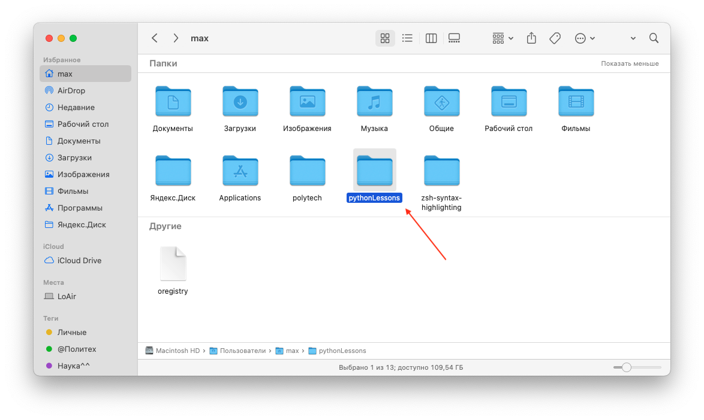

2. Зайти в нее в терминале и выполнить команду `git init` для создания локального репозитория

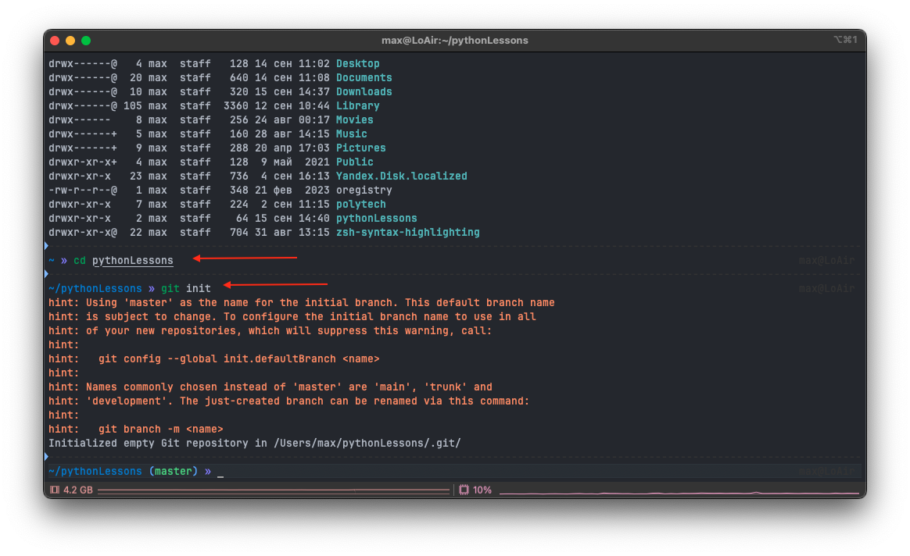

3. Откроем папку в VSC

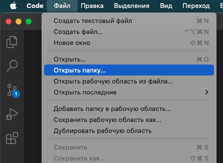
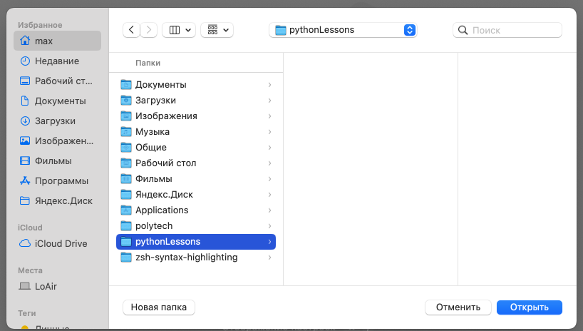

В углу можем видеть, что теперь Git отлеживает изменения в в ветви master

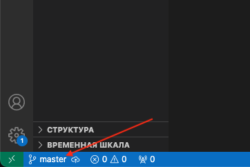

4. Убедимся, что в VSC мы вошли в аккаунт через GitHub

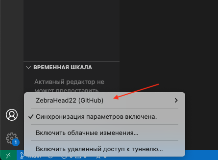

5. Создадим файл

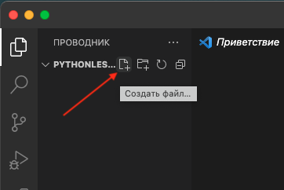

6. Во вкладке Git увидим, что файл отcлеживается. Запишем все изменения.
   
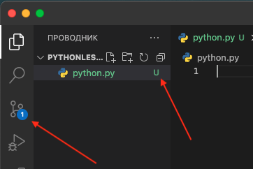
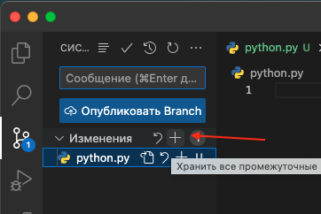

7. Теперь осталось отправить изменения и выбрать тип репозитория.
   
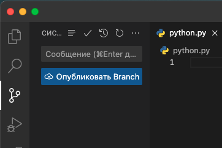
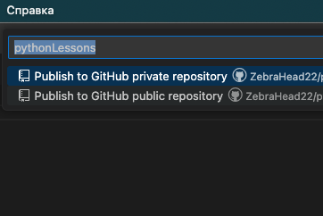
## <a id="title3">Подготовка к Python</a>

Тут разберем основные команды для работы в терминале линукса. Их не так много, как может показаться, всего 30, но каждая важна для перемещения по директориям, созданию и чтению файлов и т.д.

Теперь открываем материалы лекции по терминалу линукс (также можно сходить [сюда](https://proglib.io/p/bash-commands-for-beginners) или [сюда](https://linuxmint.su/2022/11/10/31-команда-linux-которую-должен-знать-каждый/)), VS Code и в терминале переходим в папку с репозиторием (сейчас открыт локальный каталог Python), создаем папку с названием ***Задачи***, а в ней пустой файл Python. В этом файле Вы будете учиться писать код, решать задачи и работать с Git. 

### Основные команды работы с терминалом

1. Переход к папке
```
$ cd dirname1/dirname2
```
2. Переход на уровень вверх
```
$ cd ..
```
3. Имя рабочей директории
```
$ pwd
```
4. Содержимое папки
```
$ ls -l
```
5. Создание папки
```
$ mkdir <dirname>
```
6.  Удаление файлов (аккуратно! особенно для линуксов)

```
$ rm <filename >
```
1. Удаление пустого каталога
```
$ rmdir <dirname>
```
1. Удаление непустого каталога
```
$ rm -r <dirname>
```
## Что теперь?

Сейчас настало время немного позапускать различные, уже подготовленные коды для лучшего понимания работы Python, а затем порешать задачи.

## Ссылки на практические задания

[Занятие 1](https://drive.google.com/file/d/1KUoDy-zwxpWnNYQZ7AY__kyufB3TK26V/view?usp=sharing)  
[Занятие 2](https://drive.google.com/file/d/1gb1GyT20E7jV6EX2fO3yMqRszHoM9oa3/view?usp=sharing)  
[Занятие 3](https://drive.google.com/file/d/1pcxK_n4TKyQ450cRksCWEcjV8HFfmivx/view?usp=sharing)  
[Занятие 4](https://drive.google.com/file/d/17fjdIwTOgiqAG7tkyjggx-_hfqoWBzQS/view?usp=sharing)  
[Занятие 5](https://drive.google.com/file/d/1uOeIval14jWRZ_O7RGmf8WMzehMc37pS/view?usp=sharing)   
[Занятие 6](https://drive.google.com/file/d/1nj2jJnv0088tpFmJ-ORvbGwhycZvGw7Q/view?usp=sharing)  
[Занятие 7](https://drive.google.com/file/d/1LTvkFje0wMV5b_C_M45elxMTe1xctZbt/view?usp=sharing)  
[Занятие 8](https://drive.google.com/file/d/1-rnhKrvwwDuvQkWbkcs3LVVA-4hGlEwR/view?usp=sharing)  
[Занятие 9](https://drive.google.com/file/d/1XKTk41eweimm8WCTWtWTnHg37XOLpEwg/view?usp=sharing)  
[Занятие 10](https://drive.google.com/file/d/1QXPMB1MXfZG4R-BHIJv4HvJ4ZA2ukkXN/view?usp=sharing)  
[Занятие 11](https://drive.google.com/file/d/1BoWpDhZmcoz6F3K-kIflu5lQY2e2ea6_/view?usp=sharing)  
[Занятие 12](https://drive.google.com/file/d/1OwssiiCHJ7IMtUiC7GL9rS0pA9ecrH7c/view?usp=sharing)  
[Занятие 13](https://drive.google.com/file/d/1gCmOQ7N7OHTPBCbSaY8IT5Rf3ySF3ZLK/view?usp=sharing)  

### Примечание к занятию 13.
Чтобы скачать Qt Designer перейдите по [ссылке](https://build-system.fman.io/qt-designer-download), там же найдете основные примеры по разработке кода.

# Как получить зачет
Чтобы получить зачет, необходимо:
1. Подготовить профиль на GitHub (Аватар, краткое описание о себе);
2. Решить все предлагаемые преподавателем задачи; На занятии может быть несколько задач. Необходимо решить любые 3 (или 2, если их 2).
3. Решить котнрольную работу.

Код писать только в соответствии с принятым стандартом [PEP-8](https://pythonworld.ru/osnovy/pep-8-rukovodstvo-po-napisaniyu-koda-na-python.html)!
