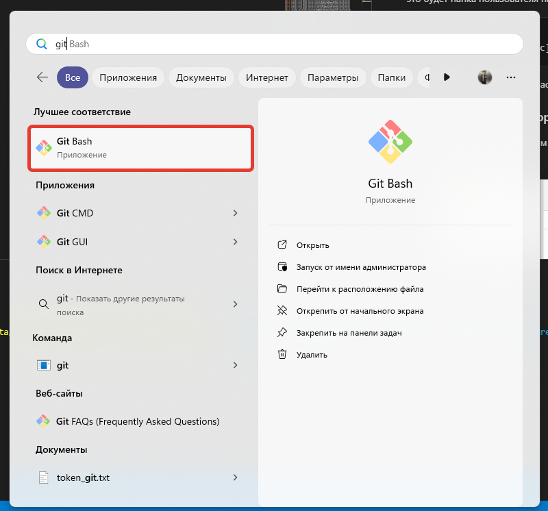
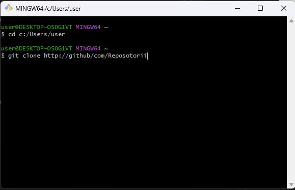
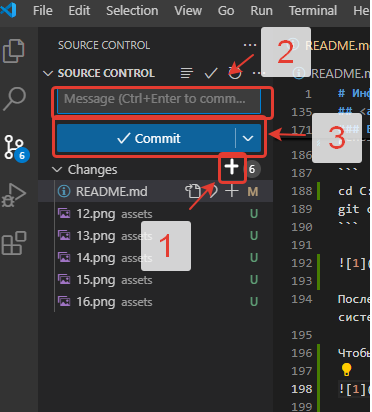

# Информатика

## Intro

Данный курс рассчитан на студентов, впервые столкнувшихся с программированием. Здесь Вы познакомитесь с полезными программами, методами разработки кода, логическим мышлением, а также поробуете начать решать задачи. Конечно, для начала самые простые, но все же реальные.

Ниже подбробно описана установка и настройка необходимого ПО для разработки, даны полезные ссылки на ресурсы, где есть информация по использованию того или иного ПО от разработчиков.

Если у Вас что-то не будет получаться, получить консультацию Вы можете в комнате 260 второго корпуса. Подходите, не стесняйтесь.  

> "*It's better to ask a question and be a fool for five minutes instead of keeping silence and remaining a fool for the whole life.*"

## GitHub

Это сайт GitHub. В первую очередь - это сервис для совместной разработки и хостинга проектов. C помощью GitHub над кодом проекта может работать неограниченное количество программистов из любых точек мира. В GitHub есть система контроля (управления) версий Git: сервис позволяет просматривать и контролировать любые изменения кода любым разработчиком и возвращаться к состоянию до изменений.

В качестве первого домашнего задания вы должны создать свой профиль на этом сайте. Добавьте аватар, информацию о себе, ссылки на почту или соц. сети по своему усмотрению. Чтобы красиво оформить профиль, создайте репозиторий с таким же именем, как имя аккаунта. При создании обязательно поставьте галочку "**Add README.md file**". Именно в этом файле вы и будете писать информацию о себе. Она создается при помощи языка [Markdown](https://gist.github.com/Jekins/2bf2d0638163f1294637) (*рекомендую его, как более простой для начинающих*) или [HTML5](https://www.tutorialspoint.com/html5/html5_syntax.htm). 
Примеры по идеям оформления профиля можно подглядеть [тут](https://proglib.io/p/kak-kreativno-oformit-profil-na-github-chtoby-on-privlekal-vnimanie-2022-03-17).

## План подготовки к работе

1. [ПО](#title1)
2. [GIT](#title2)
3. [Python](#title3)

## <a id="title1">ПО</a>


1. [Visual Studio Code](https://code.visualstudio.com/download) или [PyCharm Community Edition](https://www.jetbrains.com/ru-ru/pycharm/)
2. [Python](https://www.python.org/downloads/)  

**Важно!**  

При установке Python поставить <a id="checkbox1">галочку</a> "**add to PATH**"

3. [Git/Windows](https://git-scm.com/download/win) или [Git/Unix](https://git-scm.com/book/ru/v2/Введение-Установка-Git)

### VS Code Setup

Для начала необходимо войти в профиль в VS Code с профилем Git.
  
После этого будет стандартный запрос в браузере, мы разрешаем и возвращаемся обратно в VS Code. Слева на панели ищем вкладку с магазином расширений. Там ищем и устанавливаем расширения для нашей следующей работы:

* `ms-python.vscode-pylance`  
  > Это языковая поддержка Python по умолчанию в Visual Studio Code, которая поставляется как часть этого расширения в качестве дополнительной зависимости.
* `MS-CEINTL.vscode-language-pack-ru`
   > Русский язык для работы в VSC (опционально).
* `ms-python.python`
  > Анализ, отладка, навигация по коду, форматирование кода, рефакторинг, обозреватель переменных. , обозреватель тестов и многое другое!
* `mads-hartmann.bash-ide-vscode`
  > Расширение Visual Studio Code, использующее языковой сервер Bash и интегрируемое с объяснением Shell и Shellcheck.

### Python setup

Сейчас речь пойдет о настройке Python.
Если Вы работаете на Windows, то скорее всего Python у вас не было. Первое, что необходимо сделать, это проверить работоспособность Python. Для этого откройте командную строку и выполните команду `python`. Должен запуститься интерпретатор, показывающий версию питона и ждущий от вас указаний:

```
maksim@maksim-HP-ProOne-400-G1-AiO:~$ python3
Python 3.12.3 (main, Jul 31 2024, 17:43:48) [GCC 13.2.0] on linux
Type "help", "copyright", "credits" or "license" for more information.
>>> 
```

Чтобы выйти в терминале из Python, наберите команду `exit()`:

```
maksim@maksim-HP-ProOne-400-G1-AiO:~$ python3
Python 3.12.3 (main, Jul 31 2024, 17:43:48) [GCC 13.2.0] on linux
Type "help", "copyright", "credits" or "license" for more information.
>>> exit()
maksim@maksim-HP-ProOne-400-G1-AiO:~$ 
```
Если всего этого не происходит, необходимо проверить, добавлена ли папка с Python в переменные среды (та самая [галочка](#checkbox1)).

На Linux уже стоит Python с версией 2.х. Поэтому для запуска в терминале необходимо выполнить команду `python3`.

#### PIP

pip — система управления пакетами, которая используется для установки и управления программными пакетами, написанными на Python. Много пакетов можно найти в Python Package Index (PyPI).

Начиная с версии Python 2.7.9 и Python 3.4, они содержат пакет pip (или pip3 для Python 3) по умолчанию.

Иногда может случиться так, что данной системы у вас не будет. Ее наличие можно проверить с помощью запуска команды

```
$ pip #На Windows
#или
$ pip3 #Linux, macOS
```

Если Вы увидите что-то наподобие такого

```
$ pip

Usage:
  pip <command> [options]

Commands:
  install                     Install packages.
  download                    Download packages.
  uninstall                   Uninstall packages.
  freeze                      Output installed packages in requirements format.
  list                        List installed packages.
  show                        Show information about installed packages.
  check                       Verify installed packages have compatible dependencies.
  config                      Manage local and global configuration.
  search                      Search PyPI for packages.
  cache                       Inspect and manage pip's wheel cache.
  index                       Inspect information available from package indexes.
  wheel                       Build wheels from your requirements.
  hash                        Compute hashes of package archives.
  completion                  A helper command used for command completion.
  debug                       Show information useful for debugging.
  help                        Show help for commands.
```

то он у вас есть. В противном случае будет ошибка.

 Чтобы поставить какою-либу библиотеку, например ***numpy***, используйте

 ```
 pip install numpy
 ```

 Если системы pip у вас нет, установить ее можно следующим образом

 ```
 sudo apt get python3-pip #На Linux
 ```

На Windows менеджер пакетов pip устанавливается автоматически.

## <a id="title2">Git</a>

Что установить Git на компьютер, пользуйтесь ссылками выше. 
На MacOS git уже установлен.
Чтобы установить git на Linux (Linux Mint, Debian, Ubuntu) откройте терминал и выполните команду

```
sudo apt install git
```
Теперь необходимо настроить систему. Для этого надо ввести свое имя, почту. На системах Unix это выполняется через стандартный терминал. На Windows необходимо открыть терминал Git Bash. который Вы установили. и вводить команды там.

1. Name, email Git

```
git config --global user.name "FirstName LastName"
git config --global user.email mail_adress@example.com
```

**Важно!**  
Если указана опция `--global`, то эти настройки достаточно сделать только один раз, поскольку в этом случае Git будет использовать эти данные для всего, что вы делаете в этой системе. Если для каких-то отдельных проектов вы хотите указать другое имя или электронную почту, можно выполнить эту же команду без параметра `--global` в каталоге с нужным проектом.

2. Setup check

```
$ git config --list
user.name=FirstName LastName
user.email=mail_adress@example.com
color.status=auto
color.branch=auto
color.interactive=auto
color.diff=auto
```

Более подробная информация представлена [тут](https://git-scm.com/book/ru/v2/%D0%92%D0%B2%D0%B5%D0%B4%D0%B5%D0%BD%D0%B8%D0%B5-%D0%9F%D0%B5%D1%80%D0%B2%D0%BE%D0%BD%D0%B0%D1%87%D0%B0%D0%BB%D1%8C%D0%BD%D0%B0%D1%8F-%D0%BD%D0%B0%D1%81%D1%82%D1%80%D0%BE%D0%B9%D0%BA%D0%B0-Git).


### Вариант создания репозитория удаленно

Идем на [GitHub](https://github.com) и создаем там новый репозиторий. 


Указываем тип (приватный или публичный), пишем описание (опционально), проверяем ReadMe и .gitignore (*что такое .gitignore читать* [**тут.**](https://docs.github.com/ru/get-started/getting-started-with-git/ignoring-files)). Затем нажимаем кнопку **Code** и копируем адрес. 


После этого идем в терминал git. На Windows для этого необходимо установить Git. Ссылка выше.



Переходим ([*тут*](#title3) *приведены основные команды терминала Bash для работы*)  в ту директорию, куда хотим скопировать репозиторий. Пусть для примера это будет папка пользователя на диске `С`:

```
cd C:/Users/'имя'
git clone [тут наш адрес]
```



После указанных действий у вас будет клонирован удаленный репозиторий в указанную папку. Он также будет отслеживать изменения в системе git. 

Чтобы это проверить, откройте эту папку в Visual Studio Code


Вы должны увидеть примерную структуру файлов


Также проверьте, что у вас работает ветка *main*.


Когда вы добавите в папку новый файл, он подсветится зеленым цветом, а напротив значка Git будет стоять число, показывающее, сколько файлов было изменено. Когда Вы напишете домашнее задание и захотите отправить его на GitHub, Вы должны нажать на значок Git и выполнить следующие действия:



Когда изменения запишутся, можно делать push:


Система предупредит, что изменения записываются в основной ветке. Кликайте *OK, Don't show again*.


### Как настроить репозиторий через VS Code

1. Создать папку с будущим репозиторием


2. Зайти в нее в терминале и выполнить команду `git init` для создания локального репозитория


3. Откроем папку в Visual Studio Code (далее VSC)  или Pycharm


В углу можем видеть, что теперь Git отлеживает изменения в в ветви master


4. Убедимся, что в VSC мы вошли в аккаунт через GitHub


5. Создадим файл


6. Во вкладке Git увидим, что файл отcлеживается. Запишем все изменения.


7. Теперь осталось отправить изменения и выбрать тип репозитория.


## <a id="title3">Start</a>

Тут разберем основные команды для работы в терминале линукса. Их не так много, как может показаться, всего 30, но каждая важна для перемещения по директориям, созданию и чтению файлов и т.д.

Теперь открываем материалы лекции по терминалу линукс (также можно сходить [сюда](https://proglib.io/p/bash-commands-for-beginners) или [сюда](https://linuxmint.su/2022/11/10/31-команда-linux-которую-должен-знать-каждый/)), VS Code и в терминале переходим в папку с репозиторием (сейчас открыт локальный каталог Python), создаем папку с названием ***Задачи***, а в ней пустой файл Python. В этом файле Вы будете учиться писать код, решать задачи и работать с Git. Код писать только в соответствии с принятым стандартом [PEP-8](https://pythonworld.ru/osnovy/pep-8-rukovodstvo-po-napisaniyu-koda-na-python.html)!


## Practice

[Занятие 1](https://drive.google.com/file/d/1KUoDy-zwxpWnNYQZ7AY__kyufB3TK26V/view?usp=sharing)  
[Занятие 2](https://drive.google.com/file/d/1gb1GyT20E7jV6EX2fO3yMqRszHoM9oa3/view?usp=sharing)  
[Занятие 3](https://drive.google.com/file/d/1pcxK_n4TKyQ450cRksCWEcjV8HFfmivx/view?usp=sharing)  
[Занятие 4](https://drive.google.com/file/d/17fjdIwTOgiqAG7tkyjggx-_hfqoWBzQS/view?usp=sharing)  
[Занятие 5](https://drive.google.com/file/d/1uOeIval14jWRZ_O7RGmf8WMzehMc37pS/view?usp=sharing)  
[Занятие 6](https://drive.google.com/file/d/1nj2jJnv0088tpFmJ-ORvbGwhycZvGw7Q/view?usp=sharing)  
[Занятие 7](https://drive.google.com/file/d/1LTvkFje0wMV5b_C_M45elxMTe1xctZbt/view?usp=sharing)  
[Занятие 8](https://drive.google.com/file/d/1-rnhKrvwwDuvQkWbkcs3LVVA-4hGlEwR/view?usp=sharing)  
[Занятие 9](https://drive.google.com/file/d/1XKTk41eweimm8WCTWtWTnHg37XOLpEwg/view?usp=sharing)  
[Занятие 10](https://drive.google.com/file/d/1QXPMB1MXfZG4R-BHIJv4HvJ4ZA2ukkXN/view?usp=sharing)  
[Занятие 11](https://drive.google.com/file/d/1BoWpDhZmcoz6F3K-kIflu5lQY2e2ea6_/view?usp=sharing)  
[Занятие 12](https://drive.google.com/file/d/1OwssiiCHJ7IMtUiC7GL9rS0pA9ecrH7c/view?usp=sharing)  

### Инструкция по установке PyQt6
1. В терминале команду
`pip install pyqt6`;
2. Команда `pip install --upgrade PyQt6`;
3. Запуск скрипта `uic.py` из папки *examples/qt*.
4. На сайте [(ссылка)](https://build-system.fman.io/qt-designer-download)  скачать установочный файл Qt Designer для вашей системы: `.exe` для Windows, `.dmg` - для MacOS.

[Занятие 13](https://drive.google.com/file/d/1gCmOQ7N7OHTPBCbSaY8IT5Rf3ySF3ZLK/view?usp=sharing)  

### Контрольные работы
[КР_4931101/40001](https://colab.research.google.com/drive/1USM-Hf6pv5wJ_eTbqZDiTEcBvYybjve_?usp=sharing)    
[КР_4931101/40002](https://colab.research.google.com/drive/1MCQSMjhlOb1pyo2zDtsWzLueLr9I-47a?usp=sharing)    
[КР_4931101/40003](https://colab.research.google.com/drive/16Yo4ogCIfEe1VBdmZ0132m8cGXAi8_rS?usp=sharing)     

w
### Как получить доступ к занятиям

Все практические занятия выполнены в среде Coogle Colaboratory. Это специальный сервис, позволящий запускать код Python на удаленной машине. Чтобы все работало, необходимо:  
1. Стабильное подключение к интернету;
2. Учетная запись Google.
   
Порядок подключения (в первый раз) таков:
1. Переходим по ссылке нужного занятия. Видим:


2. Входим в учетную запись Google.
3. Нажимаем на выпадающий список рядом с кнопкой "Открыть" и выбираем пункт "Подключить другие приложения:  
  
4. Ищем **Colaboratory**, выбираем его и нажимаем кнопку "Установить":


5. Теперь кнопка "Открыть" трансформировалась в "Открыть в приложении Google Colaboratoty". Нажимаем!
   


### Примечание к занятию 13

Скачать Qt Designer можно по [ссылке](https://build-system.fman.io/qt-designer-download ).

# Exams

### Чтобы получить допуск к экзамену, необходимо:

1. Подготовить профиль на [GitHub](https://github.com):
2. Заполнить поле "О себе", создав репозиторий с именем профиля;
3. Добавить аватар;
4. Украсить профиль по своему усмотрению (см. [пример](https://proglib.io/p/kak-kreativno-oformit-profil-na-github-chtoby-on-privlekal-vnimanie-2022-03-17));
5. Решить все предлагаемые преподавателем задачи; На занятии может быть несколько задач, необходимо решить любые 3 (или 2, если их 2). Домашнее задание необходмо в виде отдельного файла `lesson_n.py` загрузить на github (`n` - номер домашнего задания).    

Если студент не решает поставленные перед ним задачи про программированию, эти задачи переносятся на время выполнения контрольной работы.

6. Решить контрольную работу.

### Экзамен проходит следующим образом:

Если студент получил допуск, он отвечает на 2 вопроса письменно + код. Оценка за экзамен ставится после собеседования с преподавателем.
